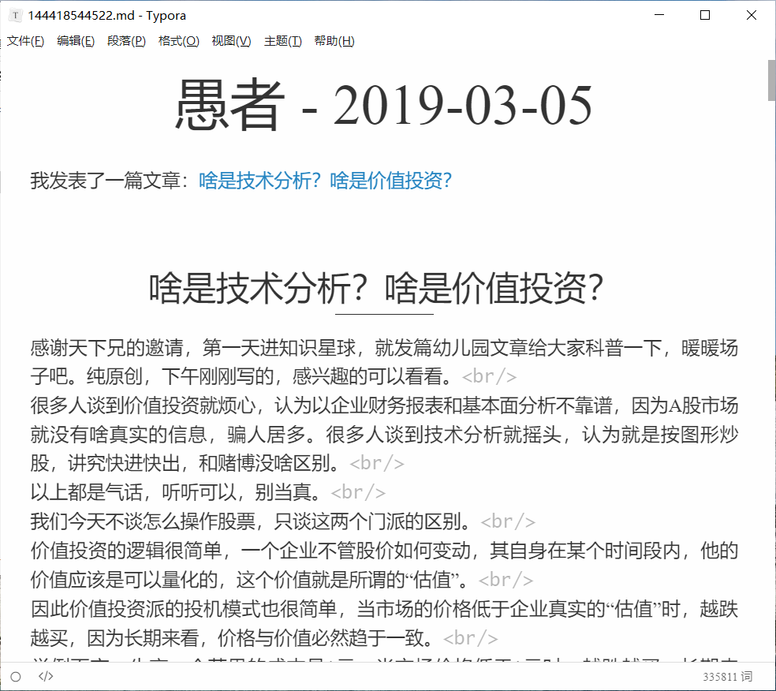

# 知识星球抓取精华主题生成 MarkDown 文件

> 请谨慎使用，有封号的风险

使用知识星球2.0接口
## 安装依赖

```bash
pip install -r requirements.txt
```

## 使用方法

修改 `main.py` 中的 `cookie` 以及 要爬取的 `group_id`
`cookie`可以从开发者工具的请求Headers中获得
`group_id`直接抄精华主题页面地址中的一串数字

```python
class ZsxqSpider(object):
    def __init__(self):
        self.group_id = "************"
        self.headers = {
            "User-Agent": "Mozilla/5.0 (Windows NT 10.0; Win64; x64) AppleWebKit/537.36 (KHTML, like Gecko) Chrome/87.0.4280.88 Safari/537.36 Edg/87.0.664.66",
            "Accept": "text/html,application/xhtml+xml,application/xml;q=0.9,image/webp,image/apng,*/*;q=0.8,application/signed-exchange;v=b3;q=0.9",
            "Accept-Language": "zh-CN,zh;q=0.9,und;q=0.8,en;q=0.7",
            "cookie": r"*******************"
        }
```

直接运行即可。

```bash
python main.py
```

## 效果

结果输出为 MarkDown 格式，可以通过 Typora 转为 HTML 或 PDF



